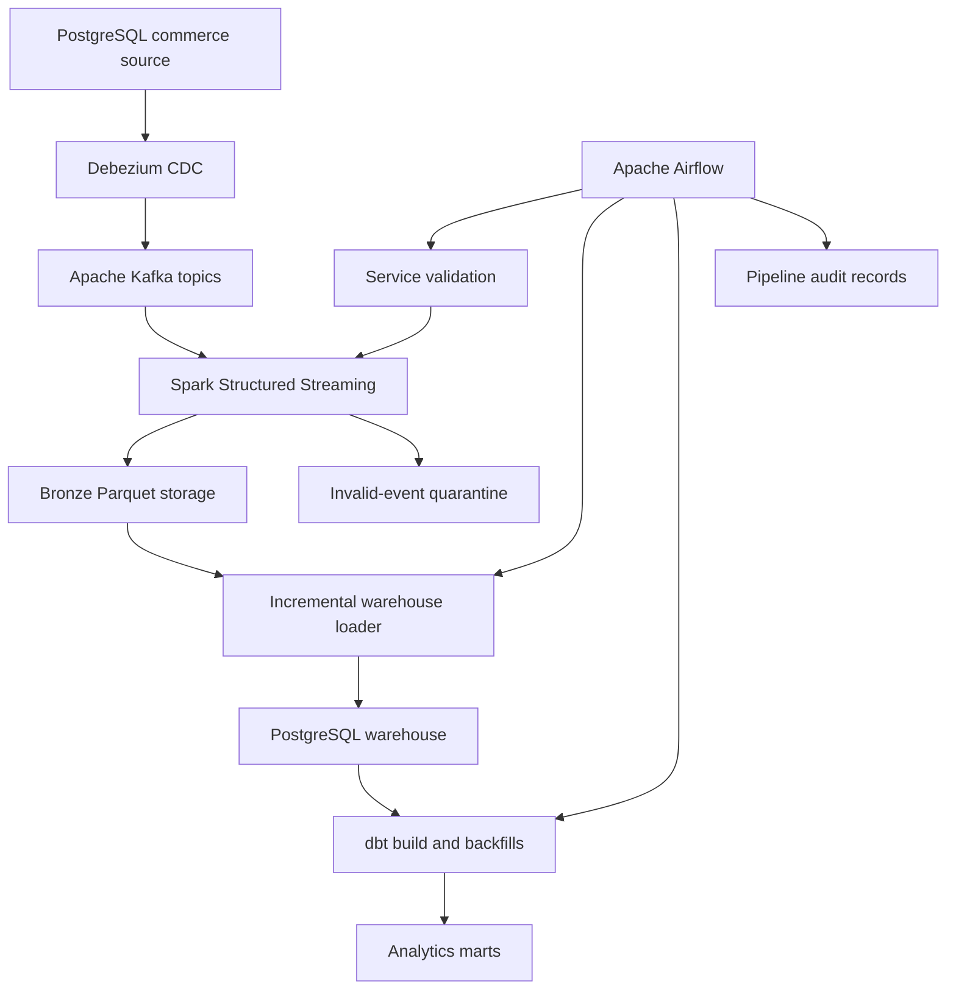

# Real-Time Commerce CDC and Analytics Platform

A Data Engineering portfolio project that captures PostgreSQL commerce changes in real time, publishes them through Debezium and Apache Kafka, and processes them with Apache Spark Structured Streaming into governed Bronze Parquet storage and a tested PostgreSQL analytical warehouse transformed with dbt.

Apache Airflow orchestrates service validation, incremental processing, warehouse loading, dbt transformations, controlled date-range backfills, failure recovery and pipeline-run auditing. Live reliability profiles reconcile every layer and report freshness, latency, service health and quarantine reasons.

## Current status

Milestones M00 through M06 are complete:

- project scope and evidence contract;
- deterministic PostgreSQL commerce source;
- six-table relational data model;
- 26,249-record controlled source dataset;
- PostgreSQL logical write-ahead logging;
- Debezium Change Data Capture;
- six table-specific Kafka topics;
- source-to-topic reconciliation;
- live create, update and delete verification;
- Apache Spark Structured Streaming;
- immutable partitioned Bronze Parquet storage;
- deterministic event identifiers;
- checkpoint-based incremental processing;
- invalid-event quarantine;
- duplicate-safe Spark JDBC warehouse loading;
- PostgreSQL analytical warehouse;
- dbt staging and current-state models;
- SCD Type 2 customer history;
- dimensions, facts and reporting marts;
- exact financial reconciliation;
- Apache Airflow 3 orchestration;
- dependency-aware eight-task pipeline execution;
- validated incremental and date-range backfill modes;
- retries, timeouts and failure callbacks;
- pipeline-run auditing and controlled failure recovery;
- live source, Bronze and warehouse reconciliation;
- operational freshness, latency and service-health profiling;
- late-event and schema-compatibility policies;
- controlled checkpoint interruption and recovery verification;
- unit and live integration testing.

M07 will add CI, deployment verification, an operational dashboard and final demonstration evidence.

## Architecture



The current data path is:

1. PostgreSQL stores deterministic operational commerce data.
2. PostgreSQL logical WAL records source changes.
3. Debezium publishes change events to six Kafka topics.
4. Airflow validates the required services and connector.
5. Airflow starts checkpoint-based Spark Structured Streaming.
6. Spark writes valid events to Bronze Parquet storage.
7. Spark writes invalid events to quarantine with failure reasons.
8. Airflow runs the duplicate-safe Bronze-to-warehouse loader.
9. Airflow runs dbt staging, current-state, snapshot, fact and mart models.
10. Incremental and date-range backfill runs rebuild affected daily rows.
11. Pipeline audit records preserve run mode, status, duration and failure metadata.

## Technology stack

| Layer | Technology |
|---|---|
| Operational source | PostgreSQL 17 |
| Change Data Capture | Debezium 3.5.2 |
| Event transport | Apache Kafka 4.1.2 |
| Stream processing | Apache Spark 4.2.0 |
| Bronze storage | Partitioned Parquet |
| Analytical warehouse | PostgreSQL 17 |
| Transformation framework | dbt Core 1.11.14 and dbt-postgres 1.11.0 |
| Orchestration | Apache Airflow 3.3.1 with LocalExecutor |
| Runtime | Python 3.12 to 3.14 |
| Containers | Docker Compose |
| Testing | Python `unittest` and dbt data tests |
| Version control | Git and GitHub |

## Source data model

The PostgreSQL `commerce` schema contains:

- `customers`
- `products`
- `orders`
- `order_items`
- `payments`
- `shipments`

The controlled source dataset is generated deterministically with seed `20260902`.

## Verified M01 source results

| Metric | Verified result |
|---|---:|
| Customers | 1,000 |
| Products | 250 |
| Orders | 5,000 |
| Order items | 12,500 |
| Payments | 5,000 |
| Shipments | 2,499 |
| Total source rows | 26,249 |
| Total order value | $5,053,882.86 |
| Average order value | $1,010.78 |
| Referential-integrity failures | 0 |
| Order-total mismatches | 0 |
| Payment-total mismatches | 0 |
| PostgreSQL WAL level | logical |
| M01 tests | 10/10 passed |

## Verified M02 CDC and Kafka results

| Metric | Verified result |
|---|---:|
| Debezium connector state | RUNNING |
| Debezium task state | RUNNING |
| Captured source tables | 6 |
| Table-specific Kafka topics | 6 |
| Kafka partitions | 18 |
| Initial snapshot events | 26,249 |
| Initial source-to-topic completeness | 100% |
| Initial source/topic count difference | 0 |
| Live create events verified | Yes |
| Live update events verified | Yes |
| Live delete events verified | Yes |
| Residual CDC probe rows | 0 |
| M02 tests | 17/17 passed |

Kafka topics:

```text
commerce.commerce.customers
commerce.commerce.products
commerce.commerce.orders
commerce.commerce.order_items
commerce.commerce.payments
commerce.commerce.shipments
```

## Verified M03 Spark Bronze results

| Metric | Verified result |
|---|---:|
| Spark version | 4.2.0 |
| Final Bronze records | 26,270 |
| Unique Bronze event IDs | 26,270 |
| Duplicate Bronze event IDs | 0 |
| Source tables represented | 6 |
| Kafka topics represented | 6 |
| Kafka partitions represented | 18 |
| Missing required metadata values | 0 |
| Initial local throughput | 992.59 events/second |
| Checkpoint-rerun new records | 0 |
| Incremental CDC records captured | 3/3 |
| Quarantined invalid events | 2 |
| Quarantine duplicate IDs | 0 |
| Median connector latency | 399 ms |
| P95 connector latency | 471 ms |
| Complete live test suite | 27/27 passed |

The initial Spark run processed 26,264 Kafka events in 26.460 seconds. A checkpoint rerun processed zero new events and produced zero duplicates.

A later live CDC verification produced three new events. Spark processed only those three new Kafka records.

Two deliberately invalid operation events were excluded from Bronze and written to quarantine with reason `unsupported_operation`.

These are local development measurements, not universal production-performance claims.

## Verified M04 warehouse and dbt results

| Result | Verified value |
|---|---:|
| Final raw warehouse events | 26,277 |
| Duplicate raw event IDs | 0 |
| Warehouse load audit runs | 5 |
| Initial insertion throughput | 1,767.66 records/second |
| Customer dimension versions | 1,001 |
| Historical customer versions | 1 |
| Order fact rows | 5,000 |
| Order-item fact rows | 12,500 |
| Payment fact rows | 5,000 |
| Shipment fact rows | 2,499 |
| Reconciled order value | $5,053,882.86 |
| Financial difference | $0.00 |
| Daily reporting dates | 18 |
| dbt data tests | 92 passed |
| Complete dbt build | 115/115 passed |
| Python and live integration tests | 33 passed |

M04 adds duplicate-safe Spark JDBC loading, a PostgreSQL analytical warehouse, dbt current-state models, SCD Type 2 customer history, dimensions, facts and reporting marts.

## Verified M05 Airflow orchestration and backfill results

| Result | Verified value |
|---|---:|
| Airflow version | 3.3.1 |
| Dependency-ordered DAG tasks | 8 |
| DAG import errors | 0 |
| Successful incremental duration | 48.036 seconds |
| Successful backfill range | 2026-01-05 through 2026-01-07 |
| Successful backfill duration | 45.464 seconds |
| Backfilled reporting rows | 3 |
| Total reporting dates after backfill | 18 |
| Duplicate reporting dates | 0 |
| Orders retained after backfill | 5,000 |
| Order value retained after backfill | $5,053,882.86 |
| Pipeline audit records | 3 |
| Successful audited runs | 2 |
| Controlled failed runs | 1 |
| Recovered backfill failures | 1 |
| Inconsistent completed audit records | 0 |
| Complete backfill dbt build | 115/115 passed |
| Python and live integration tests | 47/47 passed |

M05 adds an Apache Airflow orchestration stack, an eight-task incremental pipeline, validated date-range backfills, retries, timeouts, failure callbacks and durable pipeline-run auditing. A controlled dbt failure identified `run_dbt_build` as the failed task, and a corrected backfill rerun recovered successfully without duplicate reporting dates.

## Verified M06 reliability and observability results

| Result | Verified value |
|---|---:|
| Final operational checks | 12/12 passed |
| Live Bronze events | 26,291 |
| Warehouse events | 26,291 |
| Missing or unexpected events | 0 |
| Duplicate warehouse event IDs | 0 |
| Null required metadata values | 0 |
| Current-state table differences | 0 |
| Quarantined records | 8 |
| Recorded quarantine reason | `unsupported_operation` |
| Healthy operational components | 8/8 |
| Observed baseline out-of-order events | 0 |
| Allowed lateness threshold | 300 seconds |
| Controlled checkpoint recovery | 33.221 seconds |
| Events processed after recovery | 1 |
| Duplicate recovery events | 0 |
| Final warehouse data age | 97.584 seconds |
| Freshness SLO | 86,400 seconds |
| Average connector latency | 869.283 milliseconds |
| Reliability unit tests | 15/15 passed |
| Reliability integration tests | 6/6 passed |
| Complete Python and live integration suite | 68/68 passed |
| Complete suite duration | 51.457 seconds |
| Final dbt build | 115/115 passed |

M06 adds live cross-layer reconciliation, operational health and freshness reporting, event-order policies, schema-compatibility checks, quarantine-reason reporting and controlled Spark checkpoint-recovery evidence. Historical accumulated latency measurements are documented separately and are not presented as steady-state production performance.

## Bronze event metadata

Each Bronze event preserves:

- deterministic event ID;
- ingestion run ID;
- ingestion timestamp;
- event timestamp;
- Debezium operation;
- PostgreSQL source timestamp;
- Debezium connector timestamp;
- PostgreSQL LSN;
- PostgreSQL transaction ID;
- Kafka topic;
- Kafka partition;
- Kafka offset;
- Kafka timestamp;
- message key;
- before record;
- after record;
- Debezium payload;
- original event value;
- schema name;
- source table;
- event-date partition.

The event ID is a SHA-256 hash of:

```text
Kafka topic + Kafka partition + Kafka offset
```

## Bronze and quarantine layout

Valid events are stored as Parquet and partitioned by:

```text
source_table
event_date
```

Invalid events are stored separately and partitioned by:

```text
invalid_reason
event_date
```

Spark checkpoints are stored independently from data files. This allows normal restarts to continue from previously committed Kafka offsets.

## Quick start

### 1. Enter the project

```bash
cd ~/portfolio-lab/projects/p03-real-time-commerce-data-platform
source .venv/bin/activate
```

### 2. Install the Python package

```bash
python -m pip install -e .
```

### 3. Start PostgreSQL, Kafka and Debezium

```bash
docker compose up -d postgres kafka connect
docker compose ps
```

### 4. Wait for PostgreSQL

```bash
python scripts/wait_for_postgres.py
```

### 5. Seed the controlled source

On a fresh environment:

```bash
python scripts/seed_source.py --reset
```

The `--reset` option intentionally replaces existing source rows. Do not use it when source data must be preserved.

### 6. Register the Debezium connector

```bash
python scripts/register_connector.py
```

### 7. Verify CDC health and completeness

```bash
python scripts/profile_cdc.py
python scripts/verify_cdc_operations.py --timeout 30
```

### 8. Run Spark Bronze ingestion

```bash
docker compose --profile spark run --rm spark
```

To display only the final result:

```bash
docker compose --profile spark run --rm spark 2>&1 \
  | grep 'BRONZE_STREAM_RESULT='
```

### 9. Profile Bronze storage

```bash
docker compose --profile spark run --rm spark \
  /workspace/scripts/profile_bronze.py 2>&1 \
  | grep 'BRONZE_PROFILE_RESULT='
```

### 10. Start the analytical warehouse

```bash
docker compose up -d warehouse
python scripts/wait_for_warehouse.py
```

### 11. Load Bronze events into the warehouse

The loader compares deterministic event IDs and inserts only records that are not already present.

```bash
docker compose --profile spark run --rm spark --master local[2] --driver-memory 1g --packages org.postgresql:postgresql:42.7.13 --conf spark.jars.ivy=/tmp/.ivy2 --conf spark.sql.shuffle.partitions=4 /workspace/scripts/load_bronze_to_warehouse.py
```

### 12. Build and run the dbt project

```bash
docker build -f Dockerfile.dbt -t commerce-dbt:1.11 .
docker run --rm --network real-time-commerce_default -e WAREHOUSE_POSTGRES_HOST=warehouse -v "$PWD/dbt:/workspace/dbt" commerce-dbt:1.11 build
```

Profile the completed analytical warehouse:

```bash
python scripts/profile_warehouse.py
```

### 13. Configure the local Airflow environment

Create the ignored local environment file and replace the machine-specific values:

```bash
cp -n .env.example .env
sed -i "s/^AIRFLOW_UID=.*/AIRFLOW_UID=$(id -u)/" .env
sed -i "s|^COMMERCE_PROJECT_HOST_PATH=.*|COMMERCE_PROJECT_HOST_PATH=$PWD|" .env
sed -i "s/^DOCKER_GID=.*/DOCKER_GID=$(stat -c %g /var/run/docker.sock)/" .env
sed -i "s|^AIRFLOW_FERNET_KEY=.*|AIRFLOW_FERNET_KEY=$(openssl rand -base64 32 | tr "+/" "-_")|" .env
sed -i "s/^AIRFLOW_JWT_SECRET=.*/AIRFLOW_JWT_SECRET=$(openssl rand -hex 32)/" .env
sed -i "s/^AIRFLOW_API_SECRET_KEY=.*/AIRFLOW_API_SECRET_KEY=$(openssl rand -hex 32)/" .env
```

### 14. Build and start Airflow

```bash
docker build -f Dockerfile.airflow -t commerce-airflow:3.3.1 .
docker compose -f compose.yaml -f compose.airflow.yaml up airflow-init
docker compose -f compose.yaml -f compose.airflow.yaml up -d airflow-apiserver airflow-scheduler airflow-dag-processor
curl -sS http://127.0.0.1:8080/api/v2/monitor/health
```

The local Airflow interface is available at `http://127.0.0.1:8080`.

### 15. Trigger an incremental pipeline run

```bash
docker compose -f compose.yaml -f compose.airflow.yaml exec airflow-scheduler airflow dags trigger commerce_incremental_pipeline
```

### 16. Trigger a controlled date-range backfill

```bash
docker compose -f compose.yaml -f compose.airflow.yaml exec airflow-scheduler airflow dags trigger --conf "{\"run_mode\":\"backfill\",\"start_date\":\"2026-01-05\",\"end_date\":\"2026-01-07\"}" commerce_incremental_pipeline
```

After the DAG run completes, validate its audit records and reconciled daily mart:

```bash
python scripts/profile_orchestration.py
python scripts/profile_reliability.py
```

## Running tests

Run the local unit suite. Live integration tests are skipped unless their environment flags are enabled:

```bash
python -m unittest discover -s tests -v
```

Run only the orchestration configuration unit tests:

```bash
python -m unittest discover -s tests -p "test_orchestration.py" -v
```

After the core services, warehouse and Airflow stack are running, execute the complete live integration suite:

```bash
env RUN_POSTGRES_INTEGRATION=1 RUN_CDC_INTEGRATION=1 RUN_SPARK_INTEGRATION=1 RUN_WAREHOUSE_INTEGRATION=1 RUN_ORCHESTRATION_INTEGRATION=1 RUN_RELIABILITY_INTEGRATION=1 python -m unittest discover -s tests -v
```

The verified M06 environment completed all 68 Python and live integration tests successfully.

## Stopping and restarting

Stop the complete platform while preserving all named-volume data:

```bash
docker compose -f compose.yaml -f compose.airflow.yaml down
```

Restart the core services, warehouse and Airflow components:

```bash
docker compose -f compose.yaml -f compose.airflow.yaml up -d postgres warehouse kafka connect airflow-apiserver airflow-scheduler airflow-dag-processor
python scripts/register_connector.py
```

Run Spark Bronze ingestion when new Kafka events need to be processed:

```bash
docker compose --profile spark run --rm spark
```

Spark checkpoints preserve committed Kafka offsets, the warehouse loader compares deterministic event IDs, and the dbt daily mart replaces only the selected incremental or backfill dates.

To permanently delete the local named volumes and rebuild from an empty environment:

```bash
docker compose -f compose.yaml -f compose.airflow.yaml down -v
```

Warning: the `down -v` command permanently removes the operational PostgreSQL data, analytical warehouse, Airflow metadata database, Kafka data, Bronze storage, quarantine data, Spark checkpoints and dependency-cache volumes.

## Project structure

```text
Dockerfile.airflow
Dockerfile.dbt
compose.airflow.yaml
compose.yaml

airflow/
  dags/
    commerce_incremental_pipeline.py

dbt/
  macros/
  models/
    intermediate/
    marts/
    staging/
  snapshots/
  tests/

docs/evaluation/
  AIRFLOW_BACKFILL_M05.md
  CDC_KAFKA_M02.md
  RELIABILITY_OBSERVABILITY_M06.md
  SOURCE_M01.md
  SPARK_BRONZE_M03.md
  WAREHOUSE_DBT_M04.md

infrastructure/
  debezium/
  postgres/init/
  warehouse/init/

scripts/
  load_bronze_to_warehouse.py
  profile_bronze.py
  profile_cdc.py
  profile_orchestration.py
  profile_reliability.py
  profile_source.py
  profile_warehouse.py
  register_connector.py
  run_bronze_stream.py
  seed_source.py
  spark_kafka_smoke.py
  verify_cdc_operations.py
  verify_reliability_scenarios.py
  wait_for_postgres.py
  wait_for_warehouse.py

src/commerce_pipeline/
  bronze.py
  cdc.py
  database.py
  orchestration.py
  reliability.py
  source_data.py

tests/
  test_bronze.py
  test_cdc.py
  test_cdc_integration.py
  test_orchestration.py
  test_orchestration_integration.py
  test_reliability.py
  test_reliability_integration.py
  test_package.py
  test_postgres_integration.py
  test_source_data.py
  test_spark_bronze_integration.py
  test_warehouse_integration.py
```

## Evidence

Verified measurements and limitations are recorded in:

- `METRICS.md`
- `docs/evaluation/SOURCE_M01.md`
- `docs/evaluation/CDC_KAFKA_M02.md`
- `docs/evaluation/SPARK_BRONZE_M03.md`
- `docs/evaluation/WAREHOUSE_DBT_M04.md`
- `docs/evaluation/AIRFLOW_BACKFILL_M05.md`
- `docs/evaluation/RELIABILITY_OBSERVABILITY_M06.md`

Only results marked verified in `METRICS.md` should be used in portfolio or resume claims.

## Scope warning

This project currently uses controlled synthetic commerce data and a local Docker environment.

The completed milestones through M06 verify relational source design, CDC, Kafka transport, Spark processing, checkpoint recovery, Bronze storage, warehouse loading, dbt transformations, SCD Type 2 history, dimensional modeling, exact financial reconciliation, Airflow orchestration, date-range backfills, pipeline auditing, cross-layer reconciliation, freshness and latency measurement, schema policies and controlled failure recovery.

They do not yet prove production-cluster scalability, managed-Airflow behavior, distributed fault tolerance, multi-region recovery, cloud-object-storage performance or internet-scale throughput. The local Airflow environment mounts the Docker socket for development orchestration and is not presented as a production security design.
