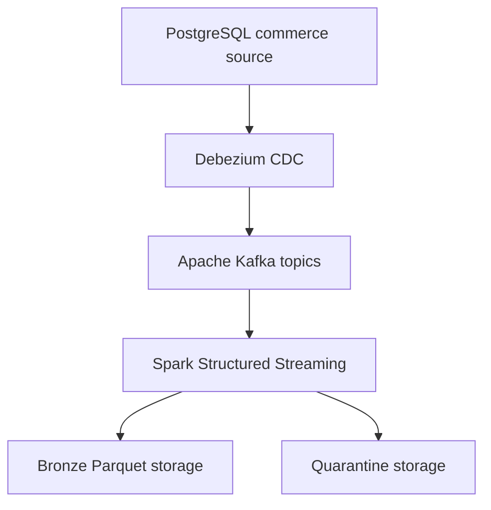

# Real-Time Commerce CDC and Analytics Platform

A Data Engineering portfolio project that captures PostgreSQL commerce changes in real time, publishes them through Debezium and Apache Kafka, and processes them with Apache Spark Structured Streaming into governed Bronze Parquet storage and a tested PostgreSQL analytical warehouse transformed with dbt.

The project emphasizes reproducibility, source-to-target completeness, metadata preservation, checkpoint recovery, invalid-record quarantine and measured evidence.

## Current status

Milestones M00 through M04 are complete:

- project scope and evidence contract;
- deterministic PostgreSQL commerce source;
- six-table relational data model;
- 26,249-record controlled source dataset;
- PostgreSQL logical write-ahead logging;
- Debezium Change Data Capture;
- six table-specific Kafka topics;
- source-to-topic reconciliation;
- live create, update and delete verification;
- Apache Spark Structured Streaming;
- immutable partitioned Bronze Parquet storage;
- deterministic event identifiers;
- checkpoint-based incremental processing;
- invalid-event quarantine;
- duplicate-safe Spark JDBC warehouse loading;
- PostgreSQL analytical warehouse;
- dbt staging and current-state models;
- SCD Type 2 customer history;
- dimensions, facts and reporting marts;
- exact financial reconciliation;
- unit and live integration testing.

Airflow orchestration, reliability engineering, observability and final deployment remain planned for M05 through M07.

## Architecture



The current data path is:

1. PostgreSQL stores operational commerce data.
2. PostgreSQL logical WAL records database changes.
3. Debezium reads those changes.
4. Debezium publishes events to Kafka topics.
5. Spark Structured Streaming consumes the Kafka events.
6. Valid events are written to Bronze Parquet storage.
7. Invalid events are written to quarantine with a reason.
8. Spark checkpoints preserve processed Kafka offsets.

## Technology stack

| Layer | Technology |
|---|---|
| Operational source | PostgreSQL 17 |
| Change Data Capture | Debezium 3.5.2 |
| Event transport | Apache Kafka 4.1.2 |
| Stream processing | Apache Spark 4.2.0 |
| Bronze storage | Partitioned Parquet |
| Runtime | Python 3.14 |
| Containers | Docker Compose |
| Testing | Python `unittest` |
| Version control | Git and GitHub |

## Source data model

The PostgreSQL `commerce` schema contains:

- `customers`
- `products`
- `orders`
- `order_items`
- `payments`
- `shipments`

The controlled source dataset is generated deterministically with seed `20260902`.

## Verified M01 source results

| Metric | Verified result |
|---|---:|
| Customers | 1,000 |
| Products | 250 |
| Orders | 5,000 |
| Order items | 12,500 |
| Payments | 5,000 |
| Shipments | 2,499 |
| Total source rows | 26,249 |
| Total order value | $5,053,882.86 |
| Average order value | $1,010.78 |
| Referential-integrity failures | 0 |
| Order-total mismatches | 0 |
| Payment-total mismatches | 0 |
| PostgreSQL WAL level | logical |
| M01 tests | 10/10 passed |

## Verified M02 CDC and Kafka results

| Metric | Verified result |
|---|---:|
| Debezium connector state | RUNNING |
| Debezium task state | RUNNING |
| Captured source tables | 6 |
| Table-specific Kafka topics | 6 |
| Kafka partitions | 18 |
| Initial snapshot events | 26,249 |
| Initial source-to-topic completeness | 100% |
| Initial source/topic count difference | 0 |
| Live create events verified | Yes |
| Live update events verified | Yes |
| Live delete events verified | Yes |
| Residual CDC probe rows | 0 |
| M02 tests | 17/17 passed |

Kafka topics:

```text
commerce.commerce.customers
commerce.commerce.products
commerce.commerce.orders
commerce.commerce.order_items
commerce.commerce.payments
commerce.commerce.shipments
```

## Verified M03 Spark Bronze results

| Metric | Verified result |
|---|---:|
| Spark version | 4.2.0 |
| Final Bronze records | 26,270 |
| Unique Bronze event IDs | 26,270 |
| Duplicate Bronze event IDs | 0 |
| Source tables represented | 6 |
| Kafka topics represented | 6 |
| Kafka partitions represented | 18 |
| Missing required metadata values | 0 |
| Initial local throughput | 992.59 events/second |
| Checkpoint-rerun new records | 0 |
| Incremental CDC records captured | 3/3 |
| Quarantined invalid events | 2 |
| Quarantine duplicate IDs | 0 |
| Median connector latency | 399 ms |
| P95 connector latency | 471 ms |
| Complete live test suite | 27/27 passed |

The initial Spark run processed 26,264 Kafka events in 26.460 seconds. A checkpoint rerun processed zero new events and produced zero duplicates.

A later live CDC verification produced three new events. Spark processed only those three new Kafka records.

Two deliberately invalid operation events were excluded from Bronze and written to quarantine with reason `unsupported_operation`.

These are local development measurements, not universal production-performance claims.

## Verified M04 warehouse and dbt results

| Result | Verified value |
|---|---:|
| Final raw warehouse events | 26,277 |
| Duplicate raw event IDs | 0 |
| Warehouse load audit runs | 5 |
| Initial insertion throughput | 1,767.66 records/second |
| Customer dimension versions | 1,001 |
| Historical customer versions | 1 |
| Order fact rows | 5,000 |
| Order-item fact rows | 12,500 |
| Payment fact rows | 5,000 |
| Shipment fact rows | 2,499 |
| Reconciled order value | $5,053,882.86 |
| Financial difference | $0.00 |
| Daily reporting dates | 18 |
| dbt data tests | 92 passed |
| Complete dbt build | 115/115 passed |
| Python and live integration tests | 33 passed |

M04 adds duplicate-safe Spark JDBC loading, a PostgreSQL analytical warehouse, dbt current-state models, SCD Type 2 customer history, dimensions, facts and reporting marts.

## Bronze event metadata

Each Bronze event preserves:

- deterministic event ID;
- ingestion run ID;
- ingestion timestamp;
- event timestamp;
- Debezium operation;
- PostgreSQL source timestamp;
- Debezium connector timestamp;
- PostgreSQL LSN;
- PostgreSQL transaction ID;
- Kafka topic;
- Kafka partition;
- Kafka offset;
- Kafka timestamp;
- message key;
- before record;
- after record;
- Debezium payload;
- original event value;
- schema name;
- source table;
- event-date partition.

The event ID is a SHA-256 hash of:

```text
Kafka topic + Kafka partition + Kafka offset
```

## Bronze and quarantine layout

Valid events are stored as Parquet and partitioned by:

```text
source_table
event_date
```

Invalid events are stored separately and partitioned by:

```text
invalid_reason
event_date
```

Spark checkpoints are stored independently from data files. This allows normal restarts to continue from previously committed Kafka offsets.

## Quick start

### 1. Enter the project

```bash
cd ~/portfolio-lab/projects/p03-real-time-commerce-data-platform
source .venv/bin/activate
```

### 2. Install the Python package

```bash
python -m pip install -e .
```

### 3. Start PostgreSQL, Kafka and Debezium

```bash
docker compose up -d postgres kafka connect
docker compose ps
```

### 4. Wait for PostgreSQL

```bash
python scripts/wait_for_postgres.py
```

### 5. Seed the controlled source

On a fresh environment:

```bash
python scripts/seed_source.py --reset
```

The `--reset` option intentionally replaces existing source rows. Do not use it when source data must be preserved.

### 6. Register the Debezium connector

```bash
python scripts/register_connector.py
```

### 7. Verify CDC health and completeness

```bash
python scripts/profile_cdc.py
python scripts/verify_cdc_operations.py --timeout 30
```

### 8. Run Spark Bronze ingestion

```bash
docker compose --profile spark run --rm spark
```

To display only the final result:

```bash
docker compose --profile spark run --rm spark 2>&1 \
  | grep 'BRONZE_STREAM_RESULT='
```

### 9. Profile Bronze storage

```bash
docker compose --profile spark run --rm spark \
  /workspace/scripts/profile_bronze.py 2>&1 \
  | grep 'BRONZE_PROFILE_RESULT='
```

## Running tests

Run local unit tests:

```bash
python -m unittest discover -s tests -v
```

Run the complete live integration suite:

```bash
RUN_POSTGRES_INTEGRATION=1 \
RUN_CDC_INTEGRATION=1 \
RUN_SPARK_INTEGRATION=1 \
python -m unittest discover -s tests -v
```

## Stopping and restarting

Stop the containers while preserving all named-volume data:

```bash
docker compose down
```

Restart the platform:

```bash
docker compose up -d postgres kafka connect
python scripts/register_connector.py
docker compose --profile spark run --rm spark
```

Checkpoints ensure the Spark job processes only Kafka events that were not previously committed.

To delete all Docker volumes and rebuild from an empty environment:

```bash
docker compose down -v
```

Warning: `docker compose down -v` permanently removes the local PostgreSQL, Kafka, Bronze, quarantine, Spark checkpoint and dependency-cache volumes.

## Project structure

```text
infrastructure/
  debezium/
  postgres/

scripts/
  profile_bronze.py
  profile_cdc.py
  profile_source.py
  register_connector.py
  run_bronze_stream.py
  seed_source.py
  spark_kafka_smoke.py
  verify_cdc_operations.py
  wait_for_postgres.py

src/commerce_pipeline/
  bronze.py
  cdc.py
  database.py
  source_data.py

tests/
  test_bronze.py
  test_cdc.py
  test_cdc_integration.py
  test_package.py
  test_postgres_integration.py
  test_source_data.py
  test_spark_bronze_integration.py
```

## Evidence

Verified measurements and limitations are recorded in:

- `METRICS.md`
- `docs/evaluation/SOURCE_M01.md`
- `docs/evaluation/CDC_KAFKA_M02.md`
- `docs/evaluation/SPARK_BRONZE_M03.md`
- `docs/evaluation/WAREHOUSE_DBT_M04.md`

Only results marked verified in `METRICS.md` should be used in portfolio or resume claims.

## Scope warning

This project currently uses controlled synthetic commerce data and a local Docker environment.

The completed milestones through M04 verify relational source design, CDC, Kafka transport, Spark processing, checkpoint recovery, Bronze storage, warehouse loading, SCD Type 2 history, dimensional modeling and exact financial reconciliation.

They do not yet prove production-cluster scalability, cloud-object-storage performance or internet-scale throughput.
